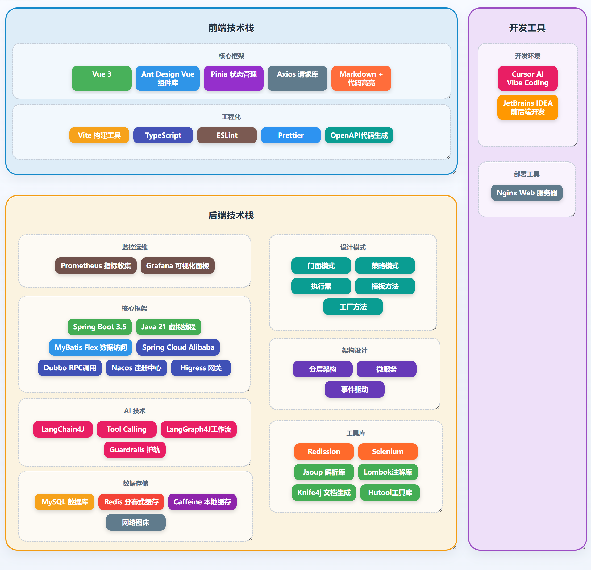
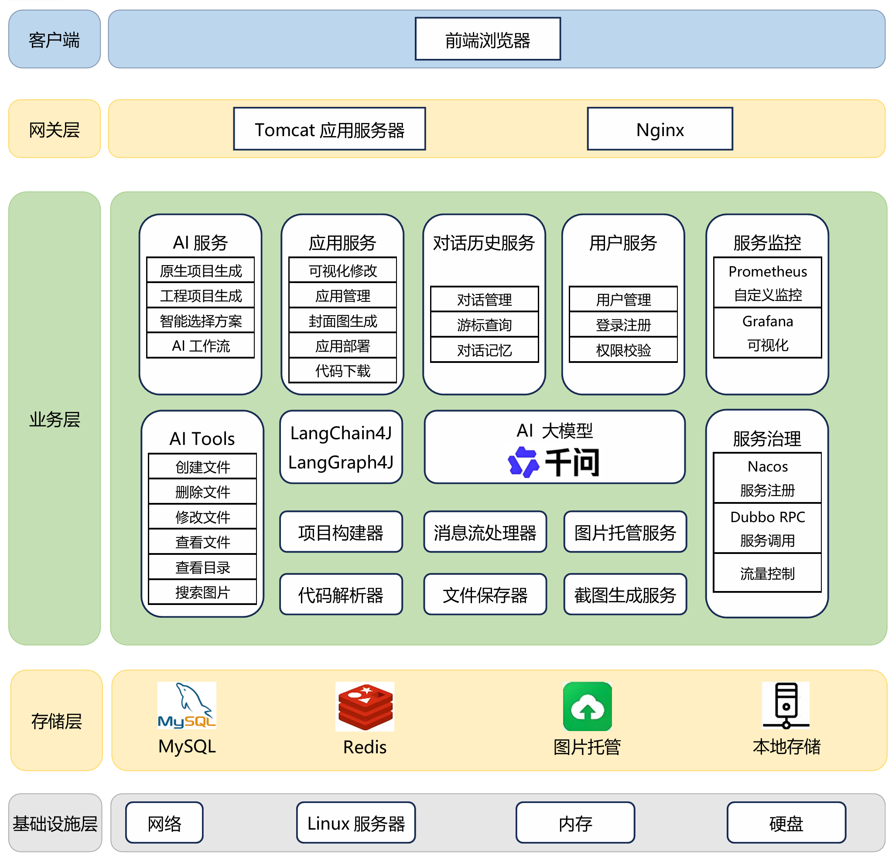
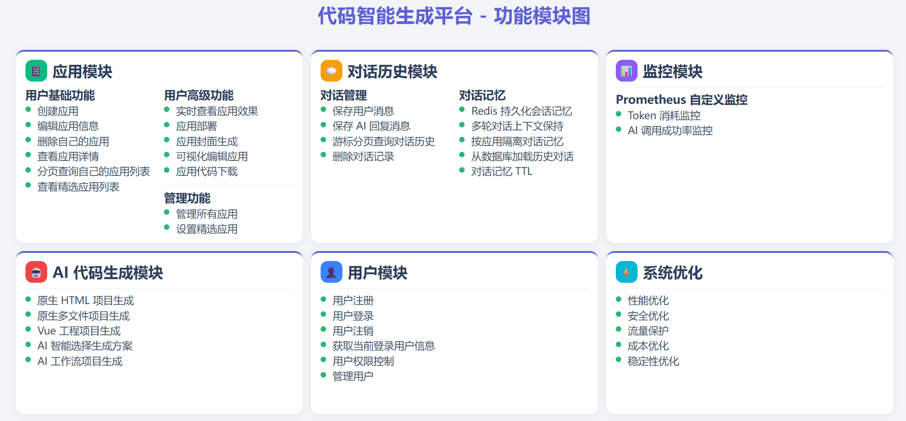
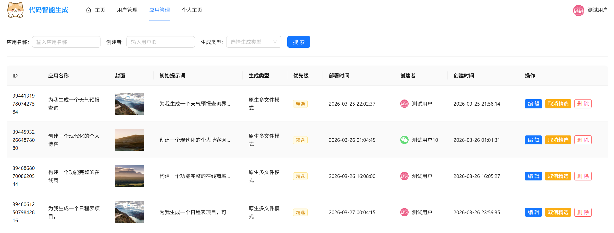
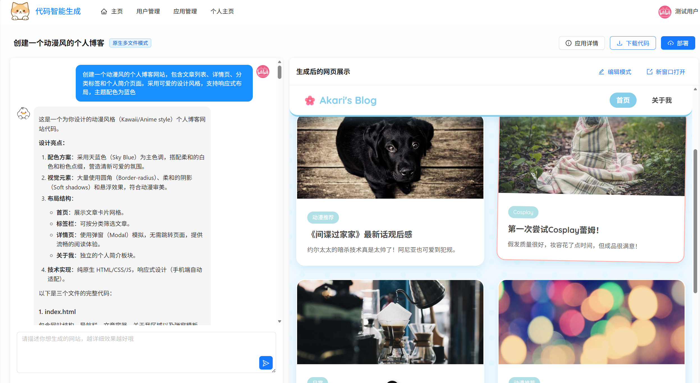
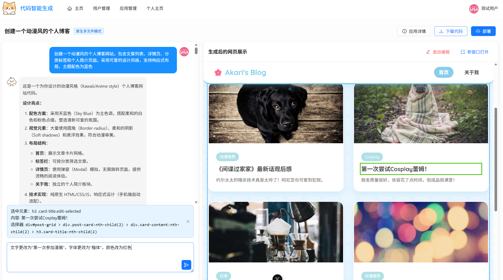
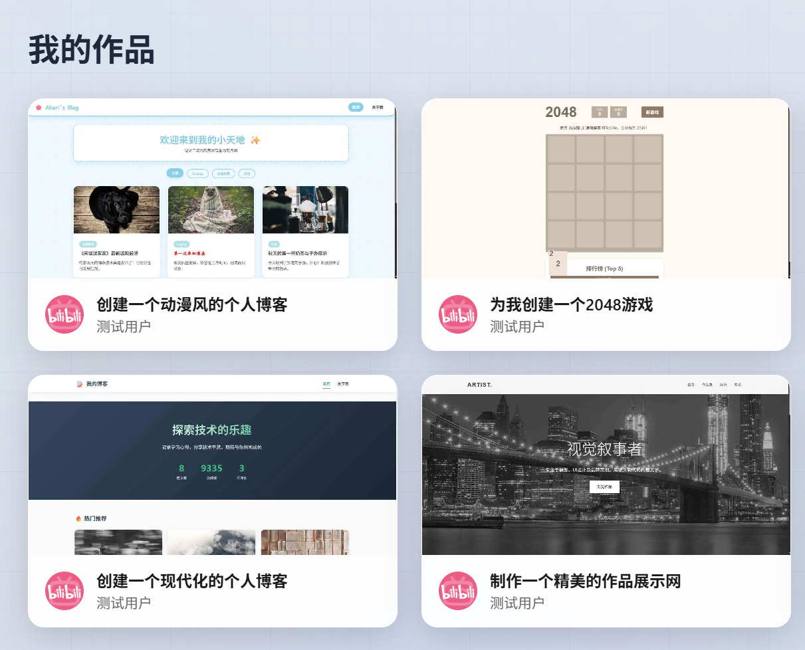

此仓库内的代码是单体版本代码，微服务版本代码查阅[此仓库](https://github.com/daydayde/ai-code-microservice)

此项目主要功能是网页智能生成，支持可视化修改和一键部署

# 技术栈

此项目核心框架使用SpringBoot3.5和JAVA 21搭建，使用Mybatis-Flex作为数据持久层中间件，
采用Redis作为分布式缓存，使用Caffeine作为本地缓存，
基于Langchain4J和千问大模型搭建智能体

# 架构设计

# 功能模块

### 应用查询
登录后，点击应用管理，即可应用查询页面。管理员支持查看全部应用，且可以设置精选应用

### 网页应用生成
输入提示词，即可自动生成网页应用。支持自动判断网页项目类型，有HTML文件模式，多文件模式，Vue项目模式，涵盖从简单到复杂的各种网页应用

### 网页修改
如果对网页生成的效果不满意可以进入编辑模式，点击网页元素，输入提示词进行修改

### 应用封面自动生成
点击部署按钮之后，可以自动生成应用封面
> 需要在[Edge官网](https://developer.microsoft.com/en-us/microsoft-edge/tools/webdriver?form=MA13LH)下载浏览器驱动，然后将驱动放入src/main/resources/edgeDriver 文件中

